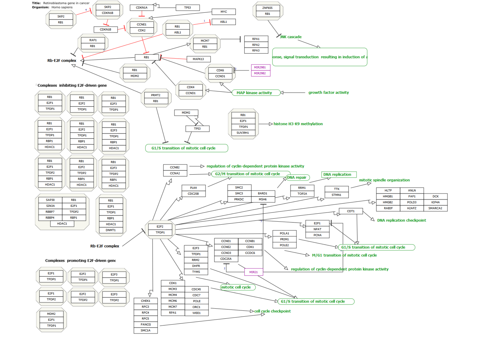
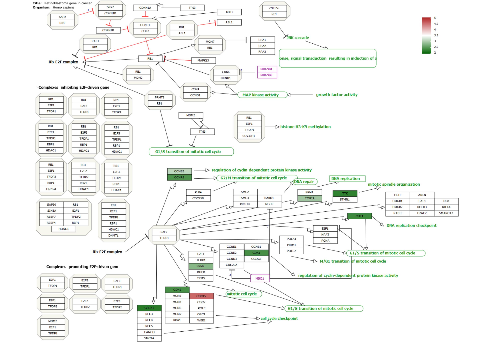
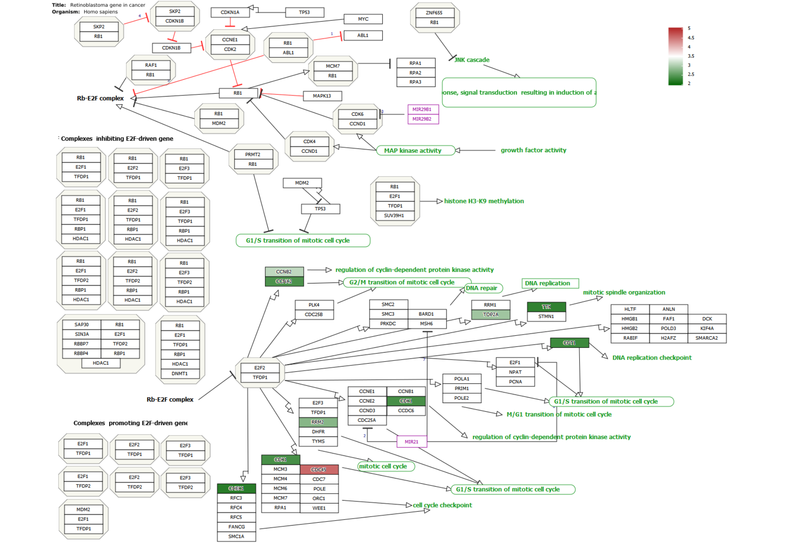

```r
library(clusterProfiler)
library(wikiprofiler)

data(geneList, package="DOSE")

de <- names(geneList)[1:100]
x <- enrichWP(de, organism='Homo sapiens')


de2 <- bitr(de, "ENTREZID", "SYMBOL", OrgDb='org.Hs.eg.db')
#### if needed
# de2 <- de2[!duplicated(de2[,1]), ]
value <- setNames(geneList[de2[,1]], de2[,2])

ID <- x$ID[1]

p1 <- wpplot(ID)
p1
```




```r
p2 <- p1 |> wp_bgfill(value, low='darkgreen', high='firebrick', legend_x = .9, legend_y = .95)
p2
```



```r
p3 <- p2 |> wp_shadowtext()
p3
```



```r
## Mus musculus
load("C:/Users/19177/Desktop/wikiprofiler/data/Mus.rda")
de <- names(Mus)[1:100]
x <- enrichWP(de, organism='Mus musculus')


de2 <- bitr(de, "ENTREZID", "SYMBOL", OrgDb='org.Mm.eg.db')
#### if needed
# de2 <- de2[!duplicated(de2[,1]), ]
value <- setNames(Mus[de2[,1]], de2[,2])

ID <- x$ID[1]

p1 <- wpplot(ID)
p2 <- p1 |> wp_bgfill(value, low='darkgreen', high='firebrick', legend_x = .9, legend_y = .95)
p3 <- p2 |> wp_shadowtext()
```